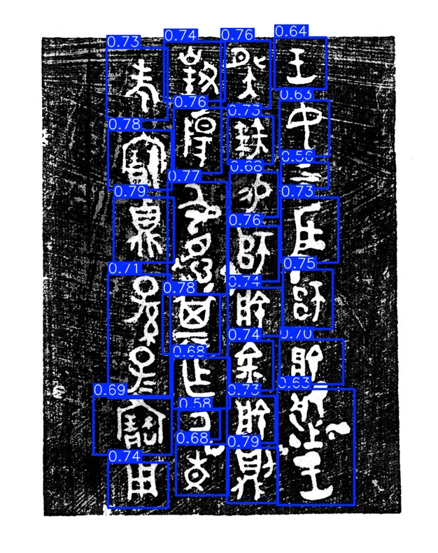
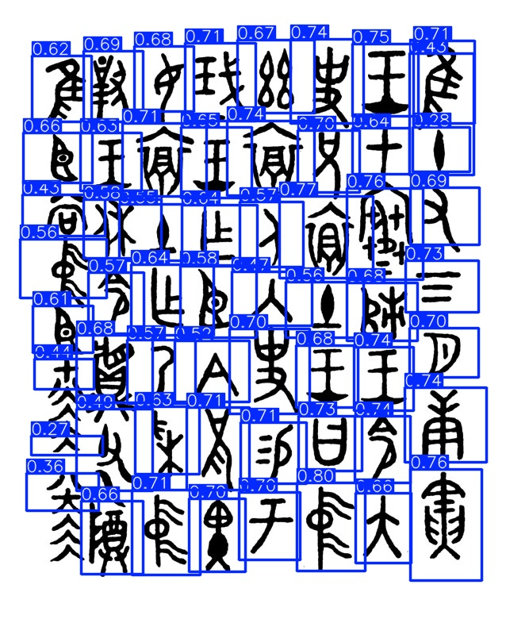
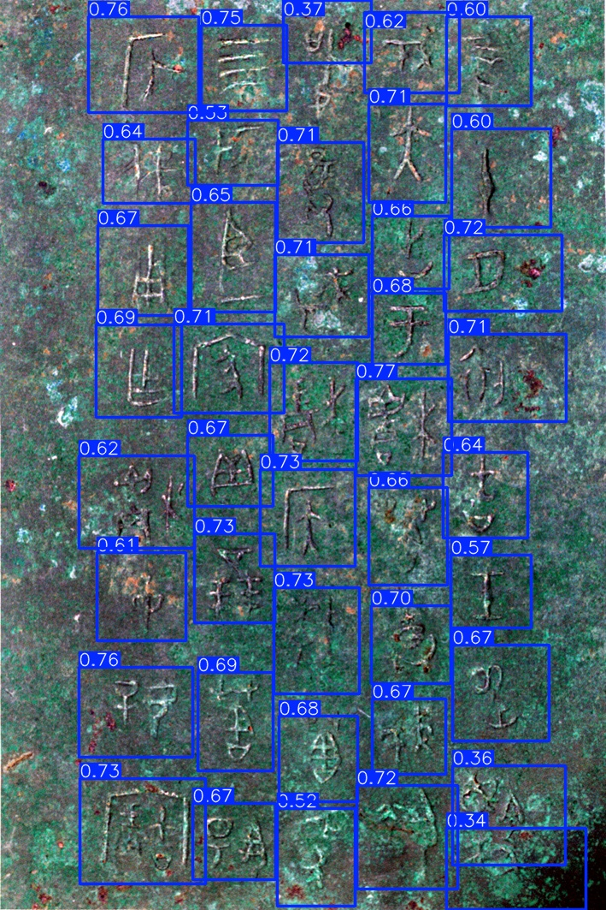

# Jinwen-Dataset
A dataset of Jinwen (Chinese Bronze Inscriptions) for OCR and paleography research.

## Dataset Generation & Composition

This repository contains a hybrid dataset of **14,000 images** (10,000 Train / 3,000 Val / 1,000 Test), combining authentic bronze inscription rubbings with sophisticated synthetic samples.

### 1. Synthesis Strategy (Multi-Character Layout)
To simulate the traditional vertical reading order and layout of bronze inscriptions, the synthetic data follows these strict constraints:
* **Density & Coverage**: Each image contains at least **25 characters**, ensuring a background coverage of over **75%**.
* **Vertical Alignment**: Characters are arranged in regular vertical columns. To mimic real rubbings, a **vertical overlap effect** is applied between adjacent characters in the same column.
* **Stochastic Variations**: To improve model robustness, the following random parameters are introduced:
    * Variations in the number of columns and characters per column.
    * Subtle fluctuations in character size, column spacing, and overlap ratios.
    * Minor affine and perspective transformations, along with brightness jittering.

### 2. Annotation & Task
* **Format**: YOLO.
* **Task**: Object Detection (Character Localization).
* **Label**: This dataset focuses solely on "where the character is." All characters are labeled under a single class: `char`. No transcription (translation) is provided in this version.

### 3. Data Augmentation (Restrained Enhancement)
To simulate the natural decay of bronze artifacts, a **Restrained Wear/Tear Augmentation** has been applied. 
* **Goal**: Introduce slight erosions and texture noise while preserving the structural integrity of the strokes. 
* **Constraint**: Augmentation is kept "conservative" to prevent the model from learning unrealistic noise patterns.

### Detection Examples

  
  
  

  <em>图：从左至右分别为不同布局下的 YOLO 识别结果</em>

## License

This dataset is licensed under the **[Creative Commons Attribution-NonCommercial-ShareAlike 4.0 International (CC BY-NC-SA 4.0)](https://creativecommons.org/licenses/by-nc-sa/4.0/)** license.

* **Non-Commercial**: This dataset may not be used for any commercial purposes or financial gain without explicit prior authorization.
* **Attribution**: Any use of this dataset must include proper credit and a link to this repository: [Insert Your Repository Link or Name Here].
* **ShareAlike**: If you remix, transform, or build upon the material, you must distribute your contributions under the same license as the original.

## Citation

If you find this dataset helpful for your research, please cite it as follows:

> [Jinmingwanxiang]. (2026). Jinwen-Dataset: A Comprehensive Dataset of Chinese Bronze Inscriptions. GitHub. [https://github.com/1bai1/Jinwen-Dataset.git]
